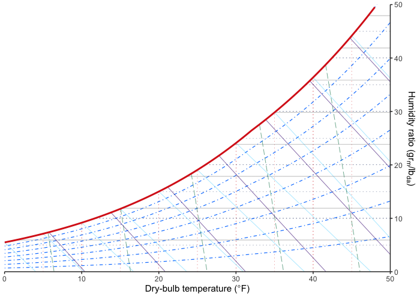
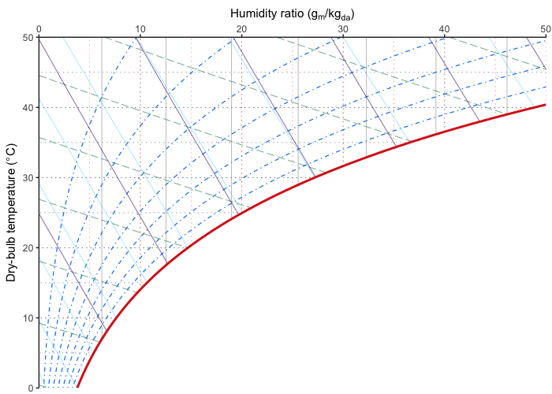
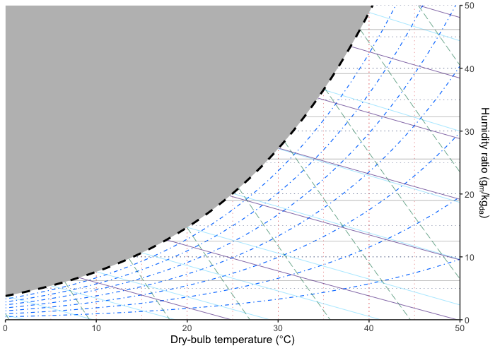
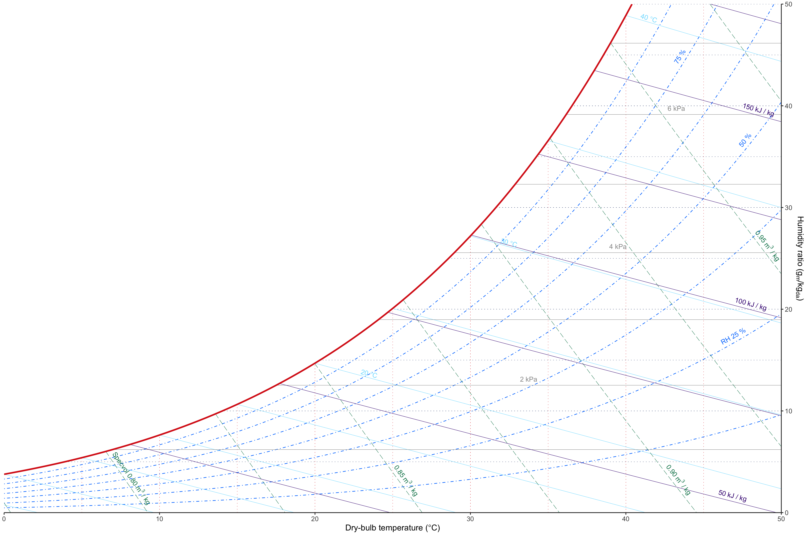
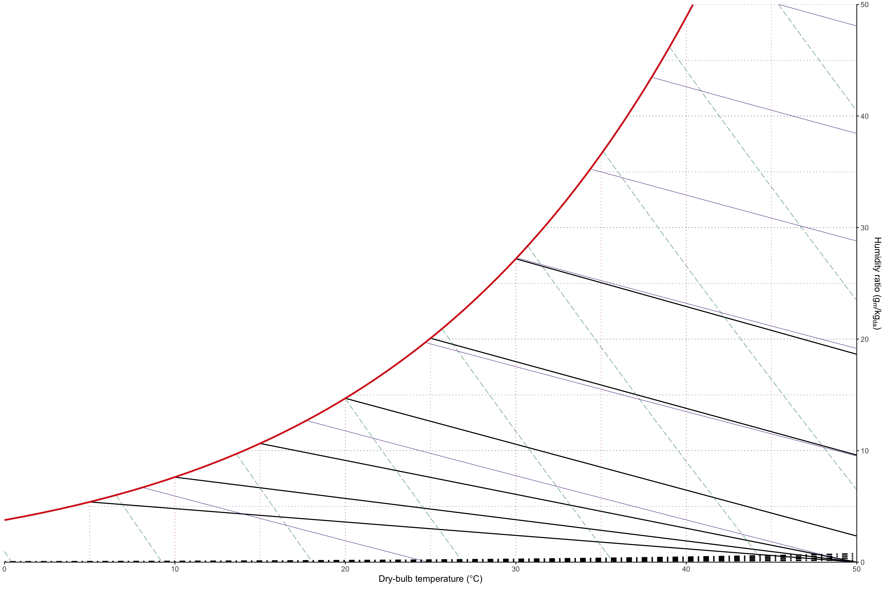
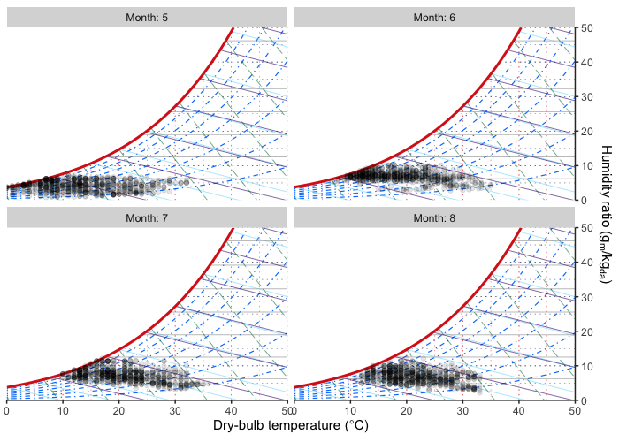
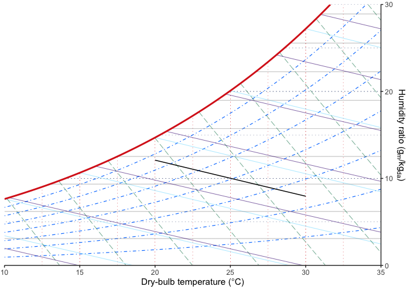

<!-- README.md is generated from README.Rmd. Please edit that file -->

# ggpsychro

<!-- badges: start -->

[](https://codecov.io/gh/hongyuanjia/ggpsychro?branch=master)
[](https://CRAN.R-project.org/package=ggpsychro)
[](https://github.com/hongyuanjia/ggpsychro/actions)
<!-- badges: end -->

> ‘ggplot2’ extension for making psychrometric charts.

## Installation

<!-- You can install the released version of ggpsychro from [CRAN](https://CRAN.R-project.org) with: -->

<!-- ``` r -->

<!-- install.packages("ggpsychro") -->

<!-- ``` -->

You can install the development version from
[GitHub](https://github.com/) with:

``` r
# install.packages("remotes")
remotes::install_github("hongyuanjia/ggpsychro")
```

## Example

### The basic

Similar with ggplot2, the creation of a psychrometric chart using
ggpsychro starts with function `ggpsychro()`. You can specify the range
of dry-bulb temperature and humidity ratio using `tdb_lim` and `hum_lim`
and the unit system using `units`.

``` r
ggpsychro(tdb_lim = c(0, 50), hum_lim = c(0, 50), units = "IP")
```



You can also create a mollier chart by setting `mollier` to `TRUE`.

``` r
ggpsychro(mollier = TRUE)
```



By default, ggpsychro draws dry-bulb temperature and humidity ratio grid
lines, the saturation curve, and the psychrometric reference grids.

The style of the saturation line can be changed using ggplot2 theme
elements.

``` r
ggpsychro(tdb_lim = c(0, 50), hum_lim = c(0, 50)) +
    theme(psychro.panel.grid.saturation = element_line(color = "black", linetype = 2))
```



### Grid

ggpsychro renders psychrometric reference grids in `coord_psychro()`. It
also provides thin ggplot-style helpers to control those grids
explicitly:

| Geom                 | Type                 |
|----------------------|----------------------|
| `geom_grid_relhum`   | Relative humidity    |
| `geom_grid_wetbulb`  | Wet-bulb temperature |
| `geom_grid_vappres`  | Vapor pressure       |
| `geom_grid_specvol`  | Specific volume      |
| `geom_grid_enthalpy` | Enthalpy             |

``` r
ggpsychro(tdb_lim = c(0, 50), hum_lim = c(0, 50)) +
    geom_grid_relhum() +
    geom_grid_wetbulb() +
    geom_grid_vappres() +
    geom_grid_specvol() +
    geom_grid_enthalpy()
```



Each grid comes with a corresponding `scale_*_continuous()` function for
customizing breaks and labels. The `geom_grid_*()` helpers do not create
data layers; they mark grids as visible or hidden and optionally
override line style.

``` r
ggpsychro(tdb_lim = c(0, 50), hum_lim = c(0, 50)) +
    geom_grid_relhum(linewidth = 0.8, color = "black") +
    scale_relhum_continuous(minor_breaks = NULL) +
    geom_grid_wetbulb(color = "black", linewidth = 0.6) +
    scale_wetbulb_continuous(breaks = seq(5, 30, by = 5), minor_breaks = NULL) +
    geom_grid_vappres(show = FALSE) +
    scale_specvol_continuous(labels = NULL) +
    geom_grid_enthalpy()
```



### Stat

ggpsychro provides 5 new ggplot stats to use together with other common
ggplot2 geoms:

| Stat            | Type                 |
|-----------------|----------------------|
| `stat_relhum`   | Relative humidity    |
| `stat_wetbulb`  | Wet-bulb temperature |
| `stat_vappres`  | Vapor pressure       |
| `stat_specvol`  | Specific volume      |
| `stat_enthalpy` | Enthalpy             |

This makes it quick and easy to add new elements.

Working together with ggplot2 original geoms is as simple as changing
`stat` to your variable name of interest.

``` r
d <- data.frame(
    dry_bulb_temperature = seq(10, 35, length.out = 200),
    relative_humidity = seq(30, 90, length.out = 200)
)

ggpsychro(d, tdb_lim = c(0, 50), hum_lim = c(0, 50)) +
    geom_grid_relhum() +
    geom_point(aes(dry_bulb_temperature, relhum = relative_humidity), stat = "relhum", alpha = 0.4)
```



``` r
ggpsychro(tdb_lim = c(10, 35), hum_lim = c(0, 30)) +
    geom_grid_relhum() +
    geom_grid_wetbulb() +
    # 18 wet-bulb line with dry-bulb from 20 - 30
    geom_line(aes(x = 20:30, wetbulb = 18), stat = "wetbulb")
```



## Author

Hongyuan Jia

## License

The project is released under the terms of MIT License.

Copyright © 2019-2025 Hongyuan Jia

## Contribute

Please note that the ‘ggpsychro’ project is released with a [Contributor
Code of Conduct](.github/CODE_OF_CONDUCT.md). By contributing to this
project, you agree to abide by its terms.
