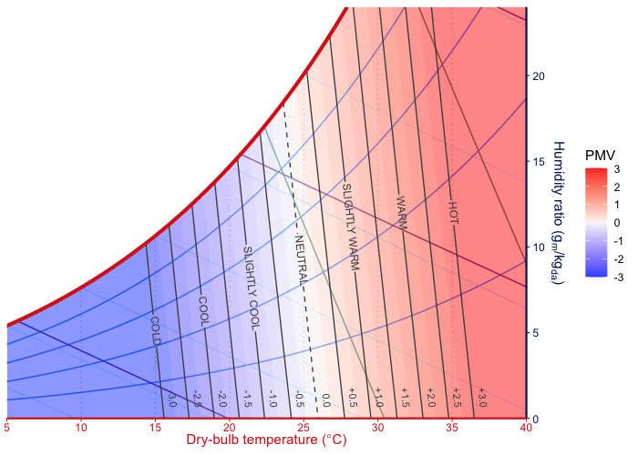

<!-- README.md is generated from README.Rmd. Please edit that file -->

# ggpsychro

<!-- badges: start -->

[](https://CRAN.R-project.org/package=ggpsychro)
[](https://github.com/hongyuanjia/ggpsychro/actions)
<!-- badges: end -->

> ‘ggplot2’ extension for making psychrometric charts.

## Features

- ggplot2-native psychrometric charts with SI/IP units and Mollier
  orientation.
- Preset grid and style helpers for common psychrometric chart layouts.
- Psychrometric stats for relative humidity, wet-bulb temperature, vapor
  pressure, specific volume, enthalpy, and humidity ratio.
- State points, process lines, and filled operating zones for HVAC
  workflows.
- Thermal comfort overlays for PMV, SET, adaptive comfort, and PMV-based
  ASHRAE 55 / EN 15251 comfort zones.

## Installation

<!-- You can install the released version of ggpsychro from [CRAN](https://CRAN.R-project.org) with: -->

<!-- ``` r -->

<!-- install.packages("ggpsychro") -->

<!-- ``` -->

You can install the development version from
[GitHub](https://github.com/) with:

``` r
# install.packages("remotes")
remotes::install_github("hongyuanjia/ggpsychro")
```

## Example

The creation of a psychrometric chart starts with `ggpsychro()`. The
result is a ggplot object, so grids, stats, geoms, scales, and themes
can be added with the same `+` workflow used by ggplot2.

``` r
ggpsychro(tdb_lim = c(0, 50), hum_lim = c(0, 30)) +
    psychro_preset("minimal")
```


Comfort overlays can be added as regular layers. The PMV overlay
combines root-traced filled bands, PMV isolines, and text labels on the
same psychrometric chart.

``` r
ggpsychro(tdb_lim = c(5, 40), hum_lim = c(0, 24)) +
    psychro_preset("minimal") +
    geom_comfort_overlay(n = c(70, 48), gap = 0) +
    scale_fill_comfort_pmv(name = "PMV") +
    geom_comfort_pmv_lines(levels = seq(-3, 3, by = 0.5), n = 140)
```



## Learn more

The longer examples live on the pkgdown site:

- [Get
  started](https://hongyuanjia.github.io/ggpsychro/articles/ggpsychro.html) -
  build basic charts, choose limits and units, use Mollier orientation,
  and add ggplot layers.
- [Chart grids and
  styles](https://hongyuanjia.github.io/ggpsychro/articles/grids-and-styles.html) -
  tune dry-bulb, humidity-ratio, relative-humidity, wet-bulb, enthalpy,
  and specific-volume grid guides.
- [Plotting psychrometric
  data](https://hongyuanjia.github.io/ggpsychro/articles/plotting-data.html) -
  plot points, bins, and overlays from weather or measured state data.
- [Zones and
  processes](https://hongyuanjia.github.io/ggpsychro/articles/zones-and-processes.html) -
  draw comfort regions, operating limits, state points, and HVAC process
  lines.

## Author

Hongyuan Jia

## License

The project is released under the terms of MIT License.

Copyright © 2019-2026 Hongyuan Jia

## Contribute

Please note that the ‘ggpsychro’ project is released with a [Contributor
Code of Conduct](.github/CODE_OF_CONDUCT.md). By contributing to this
project, you agree to abide by its terms.
