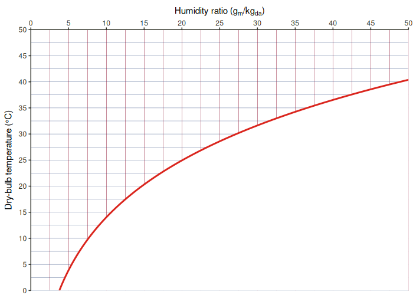

<!-- README.md is generated from README.Rmd. Please edit that file -->

# ggpsychro

<!-- badges: start -->

[](https://ci.appveyor.com/project/hongyuanjia/ggpsychro)
[](https://travis-ci.com/hongyuanjia/ggpsychro)
[](https://codecov.io/gh/hongyuanjia/ggpsychro?branch=master)
[](https://CRAN.R-project.org/package=ggpsychro)
<!-- badges: end -->

> ‘ggplot2’ extension for making psychrometric charts.

## Installation

<!-- You can install the released version of ggpsychro from [CRAN](https://CRAN.R-project.org) with: -->

<!-- ``` r -->

<!-- install.packages("ggpsychro") -->

<!-- ``` -->

You can install the development version from
[GitHub](https://github.com/) with:

``` r
# install.packages("remotes")
remotes::install_github("hongyuanjia/ggpsychro")
```

## Example

### The basic

Similar with ggplot2, the creation of a psychrometric chart using
ggpsychro starts with function `ggpsychro()`. You can specify the range
of dry-bulb temperature and humidity ratio using `tab_lim` and `hum_lim`
and the unit system using `units`

``` r
ggpsychro(tdb_lim = c(0, 50), hum_lim = c(0, 50), units = "IP")
```


You can also create a mollier chart by setting `mollier` to `TRUE`.

``` r
ggpsychro(mollier = TRUE)
```



By default, only dry-bulb temperature, humidity ratio and the saturation
line are plotted.

The style of the saturation and area above it can be further styled
using `sat_style` and `mask_style`.

``` r
ggpsychro(mask_style = list(fill = "gray"), sat_style = list(color = "black", linetype = 2))
```


### Grid

ggpsychro introduces new ggplot geoms to add 5 more grids onto the base
plot:

| Geom                 | Type                 |
| -------------------- | -------------------- |
| `geom_grid_relhum`   | Relative humidity    |
| `geom_grid_wetbulb`  | Wet-bulb temperature |
| `geom_grid_vappres`  | Vaper pressure       |
| `geom_grid_specvol`  | Specific volume      |
| `geom_grid_enthalpy` | Enthalpy             |

``` r
ggpsychro() +
    geom_grid_relhum() +
    geom_grid_wetbulb() +
    geom_grid_vappres() +
    geom_grid_specvol() +
    geom_grid_enthalpy()
```


Each of the new geom come along with a corresponding `scale_*` which can
be used to further customize the breaks of each grid

``` r
ggpsychro() +
    geom_grid_relhum(alpha = 1.0, label.alpha = 1.0, label.size = 6, label.fontface = 2) +
    scale_relhum(minor_breaks = NULL) +
    geom_grid_wetbulb(size = 1.0, color = "black", alpha = 1.0, label_loc = NA) +
    scale_wetbulb(breaks = seq(25, 30, by = 5), minor_breaks = NULL) +
    geom_grid_vappres(label.size = 5) +
    scale_vappres(breaks = seq(6000, 7000, by = 500), limits = c(6000, 7000)) +
    geom_grid_specvol() +
    scale_specvol(labels = NULL) +
    geom_grid_enthalpy()
```


### Stat

ggpsychro provides 5 new ggplot stats to use together with other common
ggplot2 geoms::

| Stat            | Type                 |
| --------------- | -------------------- |
| `stat_relhum`   | Relative humidity    |
| `stat_wetbulb`  | Wet-bulb temperature |
| `stat_vappres`  | Vaper pressure       |
| `stat_specvol`  | Specific volume      |
| `stat_enthalpy` | Enthalpy             |

This makes it quick easy to add new elements.

Working together with ggplot2 orignal geoms is as simple as change
`stat` to your variable name of interest.

``` r
library(eplusr) # for reading EPW data
epw <- read_epw(file.path(eplus_config(8.8)$dir, "WeatherData/USA_CO_Golden-NREL.724666_TMY3.epw"))

ggpsychro(epw$data()[month %in% 5:8]) +
    geom_grid_relhum() +
    geom_point(aes(dry_bulb_temperature, relhum = relative_humidity/100), stat = "relhum", alpha = 0.1) +
    facet_wrap(~month, labeller = as_labeller(function (x) paste0("Month: ", x)))
```


``` r
ggpsychro(tdb_lim = c(10, 35), hum_lim = c(0, 30)) +
    geom_grid_relhum() +
    geom_grid_wetbulb() +
    # 18 wet-bulb line with dry-bulb from 20 - 30
    geom_line(aes(x = 20:30, wetbulb = 18), stat = "wetbulb")
```


## Author

Hongyuan Jia

## License

The project is released under the terms of MIT License.

Copyright © 2019 Hongyuan Jia

## Contribute

Please note that the ‘ggpsychro’ project is released with a [Contributor
Code of Conduct](.github/CODE_OF_CONDUCT.md). By contributing to this
project, you agree to abide by its terms.
